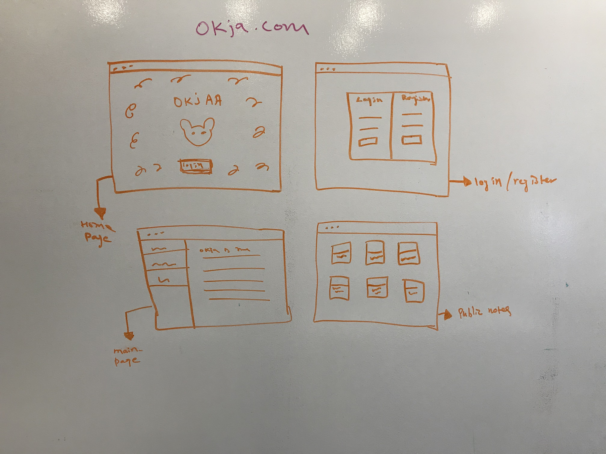

<h1 style="color:blue;"> Wahalla </h1>

<h3>A note taking app </h3>

<a href="https://note-dc934.firebaseapp.com"> Wahalla Hosting URL </a>
Project Console: https://console.firebase.google.com/project/note-dc934/overview
 
<h4>  Project Description </h4>

 This is an app for students where they can take notes and save it online and its 100% free

<h4> User Story</h4>

 Ten Ten is in school and she needs a note taking app, so that she can save her notes and review it later. She googles it and finds okja, so she checks out the link. She likes the app because its easy to navigate and simple. She starts taking note in okja, shares it with her friend and does really well in her finals.  

<h3> Technologies used </h3>
<ul> 
    <li> HTML </li>
    <li> CSS</li>
    <li> SASS </li>
    <li>React</li>
    <li>Redux</li>
    <li> Firebase </li>
</ul>

<h3> MVP </h3>
<ul> 
    <li> Fully functional website </li>
    <li> Visually appealing</li>
    <li>User Auth</li>
</ul>

<h3> POST MVP </h3>
<ul> 
    <li> Notes that can be made public for others to read </li>
    <li> Users can comment on public notes or blogs</li>
</ul>

<h3> Wireframe </h3>

  
 

